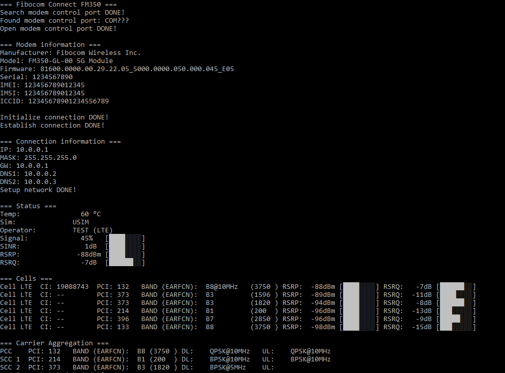

# Fibocom FM350 Connect for Windows

## Run

All script **_must_** be run as administrator

- `connect.cmd`: Connect and monitoring
- `connect_with_logs.cmd`: Connect and monitoring. With logging
- `monitor.cmd`: Connection monitoring without connect
- `monitor_with_logs.cmd`: Connection monitoring without connect. With logging

## Setup

#### APN

Edit `scripts/main.ps1` to configure your carrier APN

#### Preferred bands

Find `AT+GTACT=` in `scripts/main.ps1` and edit command to your needs.

Example:

- NR+LTE+UMTS, NR+LTE+UMTS preferred, all bands: `AT+GTACT=20,6,3,0`
- NR+LTE+UMTS, NR+LTE+UMTS preferred, NR all bands, LTE B3+B7, UMTS all bands: `AT+GTACT=20,6,3,103,107`
- Only LTE, all bands: `AT+GTACT=2,3,3,0`
- Only LTE, B3+B7: `AT+GTACT=2,3,3,103,107`

### Override DNS

Edit `scripts/main.ps1` to configure your DNS: DNS_OVERRIDE
