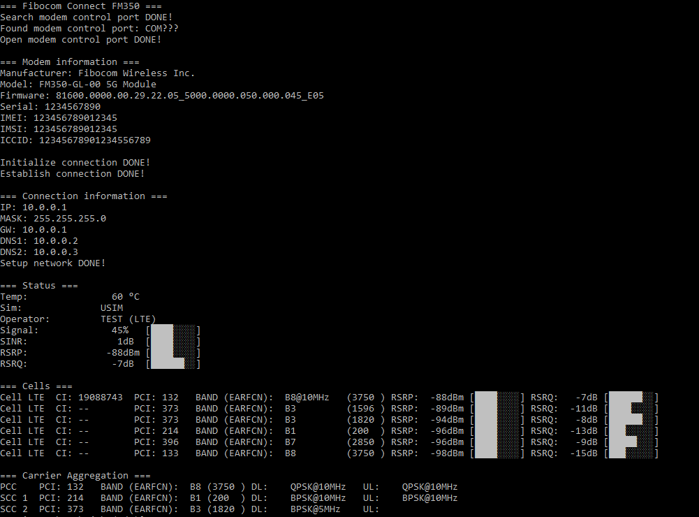

# Fibocom FM350 Connect для Windows

## Запуск

Все скрипты **_должны_** запускаться с правами администратора

- `connect.cmd`: Подключение и мониторинг
- `connect_with_logs.cmd`: Подключение и мониторинг. С логированием
- `monitor.cmd`: Мониторинг соединения без подключения
- `monitor_with_logs.cmd`: Мониторинг соединения без подключения. С логированием

## Настройка

#### APN

Отредактируйте `scripts/main.ps1` чтобы настроить APN своего оператора

#### Предпочитаемые бэнды

Найдите `AT+GTACT=` в файле `scripts/main.ps1` и отредактируйте в соостветсвии со своими предпочтениями.

Пример:

- NR+LTE+UMTS, приоритет NR+LTE+UMTS, все бэнды: `AT+GTACT=20,6,3,0`
- NR+LTE+UMTS, приоритет NR+LTE+UMTS, NR все бэнды, LTE B3+B7, UMTS все бэнды: `AT+GTACT=20,6,3,103,107`
- Только LTE, все бэнды: `AT+GTACT=2,3,3,0`
- Только LTE, B3+B7: `AT+GTACT=2,3,3,103,107`

#### Установка своих DNS серверов

Отредактируйте `scripts/main.ps1` чтобы настроить свои DNS сервера: DNS_OVERRIDE
